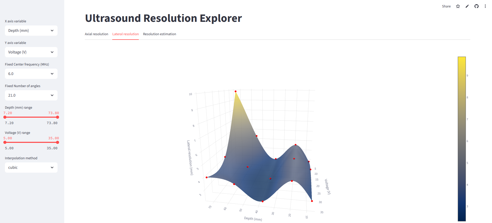
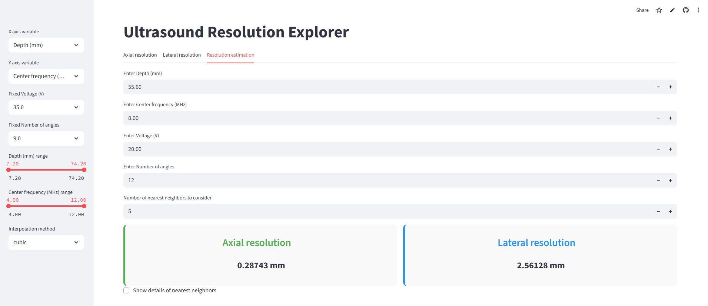

# Ultrasound Resolution Explorer

I studied the resolution of VERMON RCA 64x64 probe running on us4R-lite scanner using the CIRS 054GS phantom. 
-6dB resolution was computed for 600 points in the parameter space of: TX center frequency, depth, voltage and number of plane waves.

This project allows users to interactively visualize how **Depth**, **Center Frequency**, **Voltage**, and **Number of Angles** affect system resolution. 
It features 3D interpolation plots and a resolution estimator based on weighted nearest neighbors from the dataset.

Try the app online here: [Streamlit Ultrasound Resolution Explorer](https://share.streamlit.io/your-username/your-repo-name/main/app.py)

